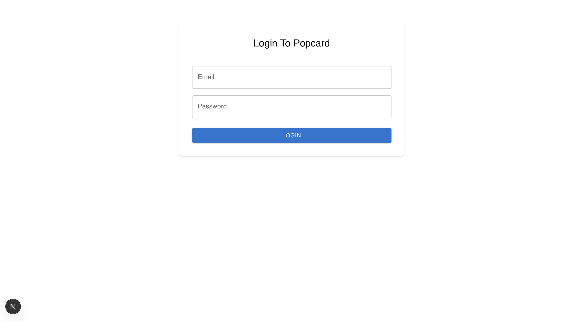
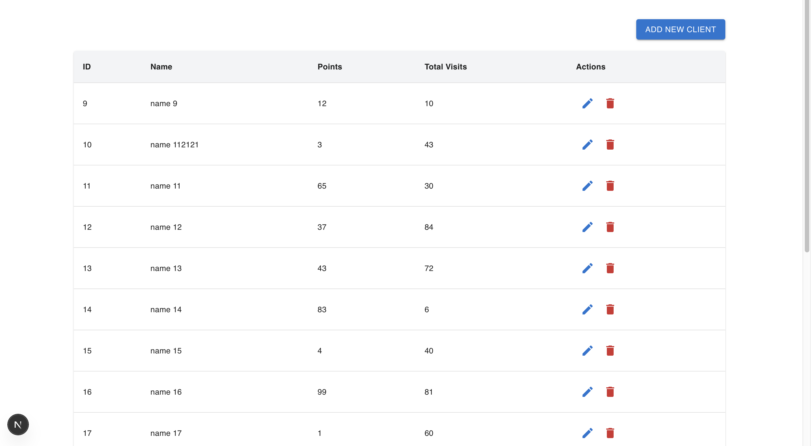
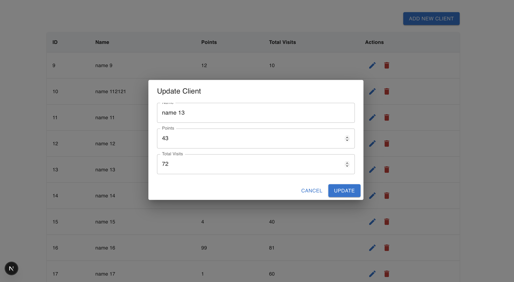
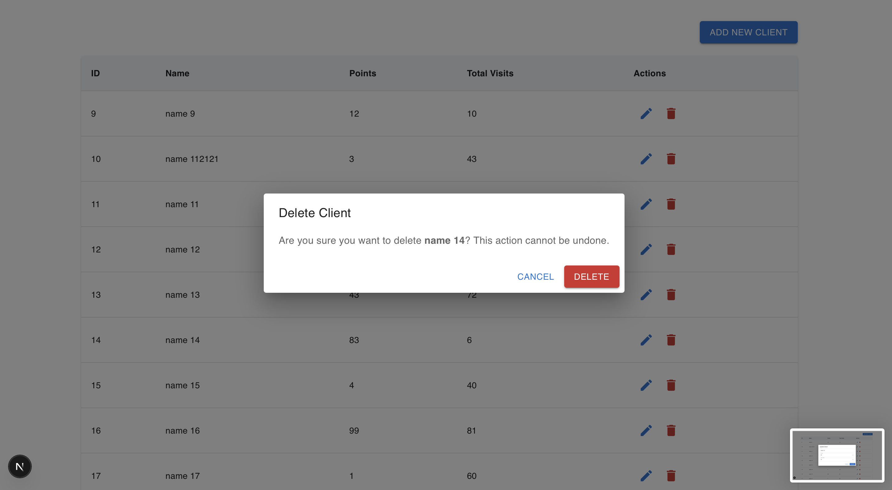

# 🎁 Mini Loyalty System

A simple web-based loyalty management backoffice built with **Next.js**, **Material UI**, and **Redux RTK Query**, using **mockapi.io** as a fake API service.

> 🧪 Project Test Objective: Build a backoffice for managing a client loyalty program.

---

## 🖥 Features

### 🔐 Login Page

- Mock login (no real authentication)
- Simple and clean UI using MUI

### 👥 Clients Page

- Table view of clients with:
  - **Name**
  - **Points**
  - **Total Visits**
- CRUD operations (Create, Read, Update, Delete)
- Responsive UI with MUI components
- All data fetching handled by **Redux RTK Query**

---

## 📸 Screenshots

### Login Page



### Clients List Page



### Add / Edit Client Modal



### Delete Confirmation Modal



---

## 🏗 Folder Structure

```
src/
├── app/ # Next.js App Router
├── components/ # Reusable UI components (Modals, Tables, Forms)
├── formik/ # Formik logic & validation schemas
├── providers/ # Redux & other global providers
├── store/ # Redux Toolkit store & RTK Query API slice
├── types/ # TypeScript types & interface

```

## 🔧 Tech Stack

- [Next.js (App Router)](https://nextjs.org/)
- [Material UI (MUI)](https://mui.com/)
- [Redux Toolkit + RTK Query](https://redux-toolkit.js.org/)
- [Formik](https://formik.org/)
- [mockapi.io](https://mockapi.io/) – for fake API

## 🚀 Getting Started

### 1. Clone the repo

```bash
git clone https://github.com/your-username/mini-loyalty-system.git
cd mini-loyalty-system

npm install
# or
yarn install


npm run dev
# or
yarn dev
```
